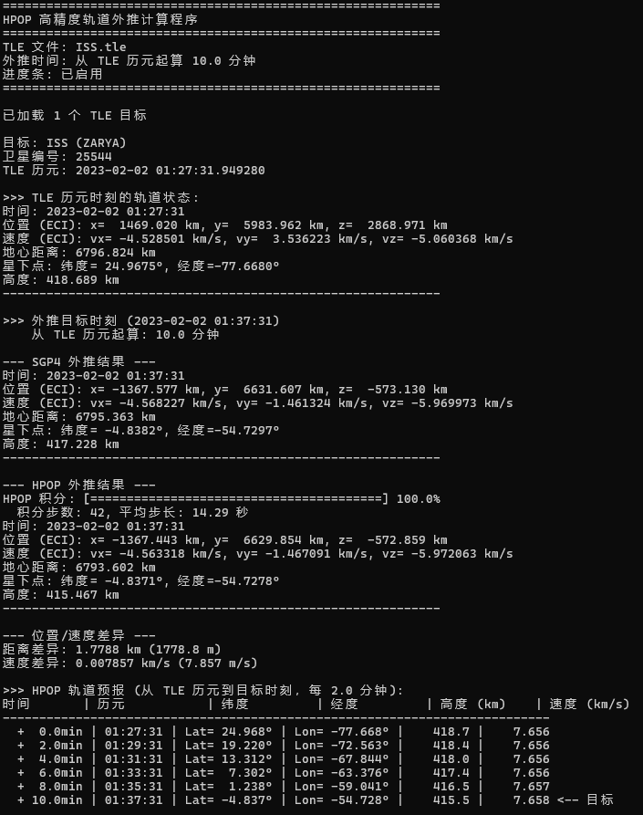

# SGP4py

SGP4/HPOP 轨道外推算法的 Python 实现，用于根据 TLE 数据计算卫星轨道位置和速度。

## 功能特性

- 解析 TLE (Two-Line Element) 轨道根数文件
- **SGP4** - 快速轨道外推（公里级精度，适用于短期预报）
- **HPOP** - 高精度轨道外推（米级精度，包含完整摄动模型）
- ECI (Earth-Centered Inertial) 坐标系位置和速度计算
- 星下点 (经纬度) 和轨道高度计算
- 未来轨道预报

## 使用方法

### SGP4 模式（快速）

运行主程序（默认使用 ISS.tle）:

```bash
python sgp4.py
```

指定 TLE 文件:

```bash
python sgp4.py <tle_file>
```

### HPOP 模式（高精度）

```bash
python sgp4.py --hpop [tle_file]       # 使用 HPOP 高精度外推
python sgp4.py --hpop --progress       # 显示进度条
python hpop.py                         # 直接运行 HPOP 模块
python hpop.py --progress              # 显示进度条 (或 -p)
```

## 输出示例



输出信息包括:
- TLE 历元时刻的轨道状态
- 当前时刻的卫星位置
- 未来轨道预报

## SGP4 vs HPOP

| 特性 | SGP4 | HPOP |
|------|------|------|
| 精度 | ~1 km | ~10 m |
| 速度 | 快 | 较慢（数值积分） |
| 摄动模型 | J2-J4 + 简化阻力 | J2-J10 + 日月引力 + 大气阻力 + 太阳辐射压 + 相对论 |
| 适用场景 | 快速预报、可视化 | 高精度定轨、任务规划 |

## TLE 数据格式

TLE (Two-Line Element) 是 NASA/NORAD 提供的卫星轨道根数数据格式，包含:
- 卫星编号和名称
- 历元时间
- 轨道倾角、升交点赤经、偏心率
- 近地点幅角、平近点角
- 平均运动、阻力系数等

项目内置了以下 TLE 文件:
- `ISS.tle` - 国际空间站
- `NOAA19.tle` - NOAA-19 气象卫星
- `shenzhou15.tle` - 神舟十五号

## 技术实现

**SGP4**: 基于 Spacetrack Report #3 和 CelesTrak 参考实现，使用 WGS72 坐标系常数:
- 地球半径：6378.135 km
- 地球重力常数：398600.8 km³/s²
- J2 带谐系数：1.082616e-3

**HPOP**: 使用 SGP4 输出的状态向量作为初始条件，采用 RK45 数值积分和以下摄动模型:
- 完整地球重力场 (J2-J10 带谐项)
- 第三体引力 (太阳、月球)
- 大气阻力 (指数大气模型)
- 太阳辐射压
- 广义相对论效应

## 依赖

仅使用 Python 标准库，无需额外安装包。

## API 示例

```python
from datetime import datetime
from sgp4 import load_tle_file, propagate_to_datetime
from hpop import hprop_from_tle, SpacecraftState

# 加载 TLE
tles = load_tle_file("ISS.tle")
tle = tles[0]

# SGP4 外推
now = datetime.now()
sgp4_result = propagate_to_datetime(tle, now)

# HPOP 外推（需要航天器参数）
spacecraft = SpacecraftState(mass=420000.0, area_drag=1000.0, area_srp=2500.0)
hpop_result = hprop_from_tle(tle, now, spacecraft)

# 计算差异
diff = hpop_result.r - sgp4_result.r
print(f"位置差异：{diff*1000:.1f} m")
```
